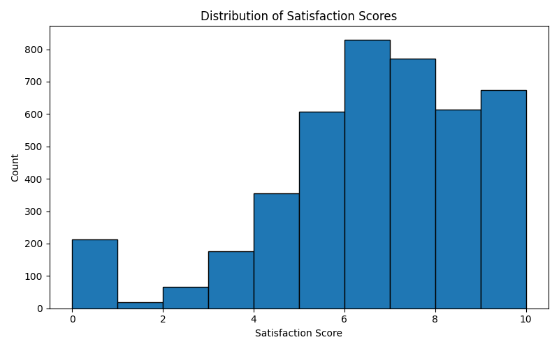
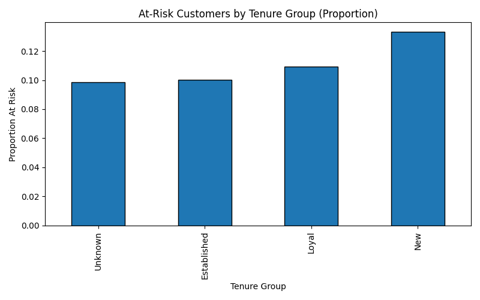

# Customer Feedback Analysis (Python)

This project uses Python to analyze a customer engagement dataset (~4,300 rows, 50+ columns). The goal is to explore satisfaction and retention patterns, visualize trends, and create a simple rule for flagging at-risk customers.
It uses pandas + matplotlib to clean data, visualize satisfaction trends, and flag at-risk customers with a simple rule.

## What I Did
- Loaded the dataset from CSV into pandas  
- Cleaned and prepped key columns (satisfaction, tenure group, retention flag)  
- Built a simple **AtRisk** flag: satisfaction score ≤ 4 = at risk  
- Created visuals with matplotlib:  
  - Distribution of satisfaction scores  
  - At-risk proportion by tenure group  
- Summarized satisfaction and retention across groups  

## Tools Used
- **Python 3.12**  
- **pandas** for data handling  
- **matplotlib** for charts  

## Example Visuals
1. **Distribution of Satisfaction Scores**

   Shows how customer scores are spread on a 1–10 scale  

2. **At-Risk Customers by Tenure Group**

   Highlights which tenure groups have higher proportions of at-risk customers  

## Why This Matters
Even simple analysis can surface useful insights:
- New-tenure customers show higher at-risk rates  
- Satisfaction scores ≤ 4 correlate with churn risk  
- A basic rule-based approach can help focus retention strategies  

## How to Run
1. Clone this repo  
2. Install requirements (from VS Code or terminal):  
   ```bash
   pip install pandas matplotlib
